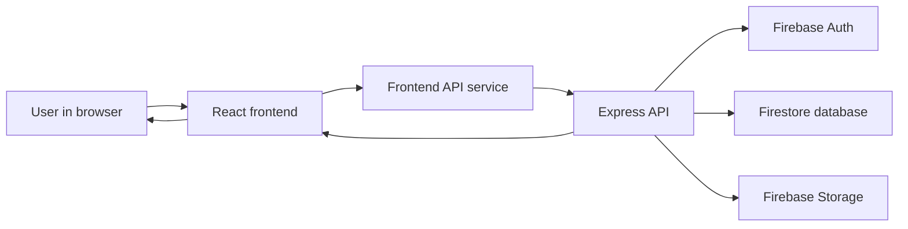
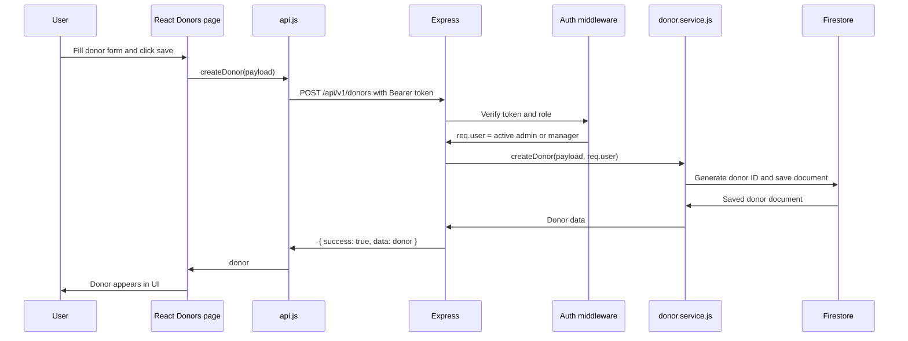

# Freepathshala Full-Stack Learning Guide

This guide explains how this project works as a complete system. It is written  to understand how React, Express, Firebase Authentication, Firestore, and Storage work together.

Use it in two ways:

1. As documentation when you need to remember what a file or API does.
2. As a learning workbook when you want to understand full-stack development concepts using your own project.

## 1. High-Level System Overview

Freepathshala has three main parts:

| Part | Technology | Simple explanation |
| --- | --- | --- |
| Frontend | React with Vite | The screen the user clicks, types into, and sees. |
| Backend | Node.js with Express | The security counter and business brain. It checks who the user is, validates data, and decides what can be changed. |
| Firebase | Auth, Firestore, Storage, Functions, Hosting | The managed platform that stores users, database records, files, and deployed app code. |

Think of the app like an office:

- React is the reception desk where people fill forms and see reports.
- Express is the manager who checks identity, permissions, rules, and paperwork.
- Firebase Auth is the ID card system.
- Firestore is the filing cabinet.
- Firebase Storage is the document/photo room.
- Firebase Hosting serves the frontend.
- Firebase Functions runs the Express API in production.

### Runtime Picture



### Important Design Choice

The frontend does not directly write normal app data into Firestore. It talks to the Express backend. The backend uses the Firebase Admin SDK, which can read and write Firestore and Storage after checking authentication and roles.

That is good production architecture because security rules are centralized in the backend instead of spread across many React components.

## 2. Complete Data Flow

Most app features follow this path:

1. User does something in the UI.
   Example: clicks "Save Donor", records a pickup, logs in, uploads Aadhaar, or views dashboard.

2. React collects the required data.
   The page component reads form state, selected donor, selected partner, role, filters, or file inputs.

3. React calls a function from `Frontend/src/services/api.js`.
   The component should not manually build fetch requests everywhere. The API service centralizes URL building, authentication headers, JSON parsing, caching, duplicate request prevention, and error handling.

4. `api.js` attaches the Firebase ID token.
   After login, the token is stored in local storage. Protected requests use:

   ```text
   Authorization: Bearer <firebase-id-token>
   ```

5. Express receives the request.
   `Backend/src/app.js` applies global middleware such as security headers, CORS, JSON parsing, logging, rate limiting, and read tracking.

6. The matching route runs.
   Example:

   ```text
   POST /api/v1/donors
   ```

   goes through `Backend/src/routes/donor.routes.js`.

7. Middleware checks authentication and role.
   `Backend/src/middleware/auth.js` verifies the token with Firebase Auth and loads the user's Firestore profile. Then `requireRoles(...)` decides whether the user's role can perform the action.

8. Validator checks the request shape.
   Zod validators in `Backend/src/validators` reject missing, invalid, or unsafe input before the service layer runs.

9. Controller calls service.
   Controllers are thin. They receive the request and call service functions. Services contain the real business logic.

10. Service reads or writes Firebase.
    Services use Firestore, Storage, and Auth through helper modules.

11. Backend returns a consistent response envelope.

    Success:

    ```json
    {
      "success": true,
      "message": "Optional message",
      "data": {}
    }
    ```

    Error:

    ```json
    {
      "success": false,
      "error": {
        "code": "ERROR_CODE",
        "message": "Human readable message",
        "details": {}
      }
    }
    ```

12. React updates the UI.
    For list data, `AppContext` stores shared state so multiple pages reuse the same data. After mutations, local state is updated where possible instead of refetching every dataset.

### Example: Create Donor



## 3. Project Folder Map

```text
Freepathshala/
  Backend/
    index.js
    package.json
    scripts/
    src/
      app.js
      server.js
      config/
      controllers/
      middleware/
      routes/
      services/
      utils/
      validators/
  Frontend/
    index.html
    package.json
    public/
    src/
      App.jsx
      main.jsx
      component/
      components/
      context/
      pages/
      services/
      utils/
  firebase.json
  firestore.rules
  firestore.indexes.json
  storage.rules
```

The repeated backend pattern is:

```text
route -> middleware -> validator -> controller -> service -> Firebase
```

The frontend pattern is:

```text
page/component -> AppContext or api.js -> backend -> AppContext/local state -> UI
```

## 4. Root File Breakdown

| File or folder | What it does | Why it exists | Connections | What breaks if removed |
| --- | --- | --- | --- | --- |
| `.gitignore` | Tells Git which files not to track. | Prevents committing generated files and secrets. | Git, local development. | Sensitive or huge files may be committed accidentally. |
| `Backend/` | Express and Firebase backend. | Contains all API, business logic, auth checks, Firebase Admin access. | Frontend calls it through `/api/v1`. Firebase Functions deploys it. | The frontend cannot securely read/write real app data. |
| `Frontend/` | React app. | Contains all user interface pages and frontend state. | Calls backend API. Built output is deployed to Firebase Hosting. | Users have no app UI. |
| `DEPLOYMENT.md` | Deployment notes. | Helps deploy and configure Firebase. | Firebase CLI and project setup. | Deployment knowledge is lost, but runtime may still work. |
| `firebase.json` | Firebase deploy config. | Defines Functions source, Hosting folder, rewrites, Firestore rules, Storage rules, emulator ports. | Deploys `Backend` as function `api` and serves `Frontend/dist`. | Firebase Hosting/Functions deploys incorrectly or not at all. |
| `firestore.indexes.json` | Firestore composite indexes. | Supports queries that filter/sort on multiple fields. | Firestore queries in backend services. | Some queries fail with "missing index" errors. |
| `firestore.rules` | Firestore client security rules. | Allows limited user/profile reads and blocks direct client writes for app data. | Firebase Auth custom claims and direct Firestore clients. | Direct client access may become unsafe or unavailable. |
| `storage.rules` | Storage client security rules. | Blocks direct Storage access; uploads/read URLs are controlled by backend. | Firebase Storage. | Files could become exposed or inaccessible depending on replacement rules. |
| `TODO.md` | Developer notes. | Tracks pending improvements. | Human workflow. | No runtime break; planning notes are lost. |

## 5. Frontend File-by-File Breakdown

### Frontend Root

| File or folder | What it does | Why it exists | Connections | What breaks if removed |
| --- | --- | --- | --- | --- |
| `Frontend/package.json` | Defines scripts and dependencies. | Vite, React, Recharts, Lucide, XLSX, lint/build scripts. | `npm run dev`, `npm run build`, `npm run lint`. | Cannot reliably install or run the frontend. |
| `Frontend/package-lock.json` | Locks exact dependency versions. | Reproducible installs. | `npm install`. | Different machines may install different versions. |
| `Frontend/index.html` | HTML entry file for Vite. | Mounts React into the page. | Loads `/src/main.jsx`. | App has no browser entry point. |
| `Frontend/vite.config.js` | Vite configuration. | Controls React plugin and build behavior. | `npm run dev`, `npm run build`. | Vite may not compile React correctly. |
| `Frontend/eslint.config.js` | Lint configuration. | Checks React hook rules and code quality. | `npm run lint`. | Code mistakes are easier to miss. |
| `Frontend/README.md` | Frontend notes. | Project reference. | Human workflow. | No runtime break. |
| `Frontend/.env` | Frontend environment variables. | Usually stores `VITE_API_BASE_URL`. | `api.js` reads Vite env values. | Frontend may call the wrong backend URL. |
| `Frontend/public/favicon.svg` | Browser tab icon. | Branding. | `index.html`. | Browser icon missing. |
| `Frontend/public/icons.svg` | Shared icon asset. | UI asset. | Components or CSS may reference it. | Referenced icons may disappear. |
| `Frontend/src/` | React source code. | Main app implementation. | Vite compiles it. | App cannot run. |
| `Frontend/dist/` | Generated production build. | Firebase Hosting serves this folder. | Created by `npm run build`. | Deployment has no built frontend. It can be regenerated. |
| `Frontend/node_modules/` | Installed dependencies. | Local development dependencies. | Generated by `npm install`. | Dev server/build cannot run locally. It can be regenerated. |

### Frontend Source

| File | What it does | Why it exists | Connections | What breaks if removed |
| --- | --- | --- | --- | --- |
| `Frontend/src/main.jsx` | Starts React and renders `App`. Adds a small global number-input wheel blur behavior. | Every React app needs an entry point. | Imports `App.jsx` and global CSS. | Nothing renders. |
| `Frontend/src/App.jsx` | Root UI controller. Shows login when unauthenticated, otherwise wraps app in `AppProvider`, layout, and selected page. Uses hash-based navigation. | Connects auth, layout, page navigation, and app data. | Uses `RoleContext`, `AppContext`, layout, and all page components. | App loses routing/auth shell. |
| `Frontend/src/App.css` | App-specific styles. | Visual layout and components. | Imported by React app. | UI styling changes or breaks. |
| `Frontend/src/index.css` | Global CSS/Tailwind import area. | Base styling across app. | Imported by `main.jsx`. | App loses global styles. |
| `Frontend/src/assets/vite.svg` | Default Vite asset. | Starter asset, likely not core. | May be unused. | Usually no important runtime break if unused. |
| `Frontend/src/services/api.js` | Central frontend API client. Adds auth token, parses responses, caches/dedupes GET calls, clears cache after mutations, wraps every backend endpoint. | Prevents duplicated fetch logic and helps reduce API over-calling. | Used by contexts and pages. Talks to `/api/v1`. | Components cannot call backend consistently; auth/caching/error handling breaks. |
| `Frontend/src/context/RoleContext.jsx` | Stores logged-in user, role, loading state, login/logout helpers. Restores session from local storage by calling `/auth/me`. | Central source for frontend auth state. | Uses `api.login`, `api.fetchCurrentUser`, `api.logout`. Used by `App.jsx` and sidebar logic. | Login state and role-aware UI break. |
| `Frontend/src/context/AppContext.jsx` | Central shared app data: donors, pickups, partners, SKS data, locations, dashboard/scheduler data, and mutation actions. | Avoids duplicate API calls across pages and reuses loaded data. | Uses many functions from `api.js`; pages consume `useAppData`. | Pages would fetch separately, causing duplicated requests and inconsistent state. |
| `Frontend/src/component/Layout/Header.jsx` | Top header with page title/subtitle and logout. | Gives every page common header behavior. | Used by `App.jsx`; logout comes from `RoleContext`. | Header/logout UI disappears. |
| `Frontend/src/component/Layout/Sidebar.jsx` | Role-aware navigation menu. | Controls which menu items are visible for admin, manager, executive. | Used by `App.jsx`; reads role. | Navigation becomes missing or unfiltered. |
| `Frontend/src/components/DonorModal.jsx` | Modal form to add a donor. | Reusable donor creation UI. | Uses `SocietyInput` and AppContext location lists/actions. | Quick donor creation flow breaks. |
| `Frontend/src/components/DonorSearchSelect.jsx` | Searchable donor dropdown with keyboard/outside-click behavior. | Helps pickup screens select donors efficiently. | Used by pickup-related pages. | Donor selection UX becomes clumsy or unavailable. |
| `Frontend/src/components/PickupTabs.jsx` | Displays pickup groups in tabs. | Reusable scheduled/overdue/at-risk/churned style tables. | Used by pickup overview/scheduler flows. | Pickup tab UI breaks. |
| `Frontend/src/components/SocietyInput.jsx` | Lets user choose existing society or type a custom one. | Avoids duplicate society typing while still supporting new societies. | Used in donor and location-related forms. | Society entry becomes inconsistent. |
| `Frontend/src/pages/Dashboard.jsx` | Analytics dashboard with filters and charts. | Gives admin/manager a summary view. | Calls `fetchDashboardStats`; uses Recharts. | Dashboard page breaks. |
| `Frontend/src/pages/Donors.jsx` | Donor list, donor detail, edit/update/delete flows. | Main donor management screen. | Uses AppContext donor arrays and donor actions. | Donor management UI breaks. |
| `Frontend/src/pages/Supporters.jsx` | Supporter/donor analytics based on donor and pickup data. | Helps understand supporter behavior. | Reads AppContext donors/pickups. | Supporter analytics page breaks. |
| `Frontend/src/pages/Pickups.jsx` | Records completed pickups and can link them to scheduled pickups. | Main operational flow for completed pickup entry. | Uses donors, partners, items, create/record pickup actions. | Pickup completion flow breaks. |
| `Frontend/src/pages/PickupScheduler.jsx` | Schedules future pickups. | Separates planning from recording completion. | Calls `schedulePickup`; uses CSS file. | Future pickup scheduling breaks. |
| `Frontend/src/pages/PickupScheduler.css` | Styles scheduler screen. | Keeps scheduler-specific CSS separate. | Imported by scheduler page. | Scheduler layout may look broken. |
| `Frontend/src/pages/Todaypickups.jsx` | Shows today's pending pickup workflow. | Helps executive/operations handle daily pickup list. | Uses scheduler data and navigates to pickup recording with donor/pickup IDs. | Today's operations page breaks. |
| `Frontend/src/pages/PickupOverview.jsx` | Pickup analytics/overview. | Gives a broader pickup status view. | Reads AppContext pickups/donors/partners. | Pickup reporting page breaks. |
| `Frontend/src/pages/Pickuppartners.jsx` | Pickup partner directory and add/edit/delete partner forms with file uploads. | Manages field partners and their documents. | Calls partner API using FormData through `api.js`. | Partner management and photo/Aadhaar upload break. |
| `Frontend/src/pages/Payments.jsx` | Partner payment hub, RST analytics, SKS payment analytics. | Handles payment recording and balance views. | Calls payment APIs and raddi/SKS data APIs. | Payment workflows break. |
| `Frontend/src/pages/RaddiMaster.jsx` | Admin view of raddi records with backend pagination/filtering. | Handles heavier record browsing without loading everything into frontend. | Calls `fetchFilteredRaddiRecords`. | Raddi record admin table breaks. |
| `Frontend/src/pages/SKSOverview.jsx` | SKS stock, inflow, outflow, and proof/file related flows. | Manages SKS inventory movement. | Uses SKS context actions and upload helpers. | SKS inventory workflow breaks. |
| `Frontend/src/pages/UserManagement.jsx` | Admin user CRUD screen. | Creates/updates/deletes app users and roles. | Calls `/users` APIs through `api.js`. | Admin cannot manage users from UI. |
| `Frontend/src/utils/helpers.js` | Common formatters and helpers: date, currency, badge classes, XLSX export, WhatsApp template parsing. | Keeps repeated UI utility logic in one place. | Imported by pages/components. | Many formatting/export helpers break. |

## 6. Backend File-by-File Breakdown

### Backend Root

| File or folder | What it does | Why it exists | Connections | What breaks if removed |
| --- | --- | --- | --- | --- |
| `Backend/package.json` | Backend scripts and dependencies. | Express, Firebase Admin, Functions, validation, upload middleware. | `npm run dev`, `npm run start`, deploy scripts. | Backend cannot reliably install/run. |
| `Backend/package-lock.json` | Locks backend dependency versions. | Reproducible backend installs. | `npm install`. | Different machines may install different dependency versions. |
| `Backend/index.js` | Firebase Functions entry. Exports Express API as HTTPS function and includes auth cleanup trigger. | Required for Firebase Functions deployment. | Imports `src/app.js`. | Production function deployment breaks. |
| `Backend/src/server.js` | Local server entry with `app.listen`. | Lets you run backend locally without Firebase Functions. | Imports `src/app.js` and `env.port`. | `npm run dev/start` cannot serve locally. |
| `Backend/src/app.js` | Builds the Express app. Adds security, CORS, parsers, logger, rate limiter, health route, API routes, and error handling. | Central backend runtime wiring. | Imports routes, middleware, logger, env. | No API request can be handled. |
| `Backend/README.md` | Backend notes. | Human reference. | Developer workflow. | No runtime break. |
| `Backend/.env` | Backend secrets and config. | Firebase credentials, API key, CORS, port, setup secret. | Read by `config/env.js`. | Auth/Firebase/backend config fails. |
| `Backend/service-account.json` | Firebase service account credential. | Lets Admin SDK authenticate if using file-based credentials. | Used by Firebase Admin setup depending on environment. | Admin SDK may fail if no other credentials exist. Warning: do not commit real secrets to public repos. |
| `Backend/node_modules/` | Installed backend dependencies. | Local runtime dependencies. | Generated by `npm install`. | Backend cannot run locally. It can be regenerated. |

### Backend Scripts

| File | What it does | Why it exists | Connections | What breaks if removed |
| --- | --- | --- | --- | --- |
| `Backend/scripts/check-syntax.js` | Checks backend syntax/import validity. | Quick backend verification. | `npm run check`. | You lose this local check. |
| `Backend/scripts/setup-first-admin.js` | Helps create or mark first admin. | Bootstrap problem: someone must become admin before admin-only screens are usable. | Setup service/users/Firebase Auth. | First admin setup becomes manual. |
| `Backend/scripts/verify-auth-setup.js` | Verifies auth configuration. | Catches Firebase/Auth env mistakes. | Auth service/config. | Auth setup is harder to verify. |
| `Backend/scripts/seed-locations.js` | Seeds city/sector/society data. | Initializes location master data. | Location service/Firestore. | Fresh databases lack default locations. |
| `Backend/scripts/seed-master-data.js` | Seeds RST/SKS item master data. | Initializes item lists. | Master data service/Firestore. | Fresh databases lack default items. |

### Backend Config

| File | What it does | Why it exists | Connections | What breaks if removed |
| --- | --- | --- | --- | --- |
| `Backend/src/config/env.js` | Reads environment variables and exposes typed config. | Keeps secrets/config in one predictable place. | Used across app, Firebase, uploads, CORS, setup. | Many services cannot read config safely. |
| `Backend/src/config/firebase.js` | Initializes Firebase Admin SDK and exports `admin`, `db`, `auth`, `storage`, `getBucket`. | One shared Firebase connection. | Used by nearly every service. | Firestore/Auth/Storage access breaks. |
| `Backend/src/config/collections.js` | Central Firestore collection names. | Avoids typo bugs in collection paths. | Used by services. | Services may write to wrong/missing collections. |
| `Backend/src/config/logger.js` | JSON console logger. | Consistent logs. | App/services use it for info/errors. | Debugging becomes less consistent. |
| `Backend/src/config/masterData.js` | Default master item data and statuses. | Provides fallback/seed values. | Master data service. | Empty DB may lack usable default items. |
| `Backend/src/config/roles.js` | Defines roles and permissions. | Central RBAC vocabulary: admin, manager, executive. | Auth middleware, services, frontend assumptions. | Role checks become scattered or inconsistent. |

### Backend Middleware

Middleware is code that runs before the controller. Think of it like a checkpoint before a visitor enters an office.

| File | What it does | Why it exists | Connections | What breaks if removed |
| --- | --- | --- | --- | --- |
| `Backend/src/middleware/auth.js` | Verifies Firebase ID token, loads user profile, checks active status, checks roles. | Protects private APIs. | Routes use `requireAuth` and `requireRoles`. | Anyone could call protected APIs, or all protected APIs fail. |
| `Backend/src/middleware/validate.js` | Runs Zod validation for body/query/params. | Stops bad data before it reaches services. | Routes and validator files. | Invalid data reaches business logic and Firestore. |
| `Backend/src/middleware/errorHandler.js` | Converts thrown errors into consistent API error responses. | Keeps frontend error handling predictable. | Used at the end of `app.js`. | Errors may leak stack traces or return inconsistent shapes. |
| `Backend/src/middleware/upload.js` | Configures Multer memory uploads and partner document fields. | Handles multipart file uploads. | Partner routes and upload route. | File upload APIs break. |
| `Backend/src/middleware/rateLimit.js` | Simple in-memory IP rate limiter with headers. | Protects backend from excessive calls. | Applied in `app.js`. | Backend is easier to overload. |

### Backend Controllers

Controllers translate HTTP into service calls. They should stay small.

| File | What it does | Why it exists | Connections | What breaks if removed |
| --- | --- | --- | --- | --- |
| `auth.controller.js` | Login, refresh, forgot password, me, logout, change password, auth user role helpers. | HTTP layer for authentication. | Auth routes and auth service. | Auth endpoints break. |
| `user.controller.js` | Admin user CRUD. | HTTP layer for user management. | User routes and user service. | User management endpoints break. |
| `donor.controller.js` | Donor CRUD. | HTTP layer for donors. | Donor routes and donor service. | Donor endpoints break. |
| `pickupPartner.controller.js` | Pickup partner CRUD and file upload handling. | HTTP layer for partner forms/files. | Partner routes, upload middleware, partner service. | Partner endpoints break. |
| `pickup.controller.js` | Pickup list/create/update/record/delete and raddi records. | HTTP layer for pickup operations. | Pickup routes and pickup service. | Pickup endpoints break. |
| `payment.controller.js` | Partner summary, pickup payments, record payments, clear balance. | HTTP layer for payment operations. | Payment routes and payment service. | Payment endpoints break. |
| `sks.controller.js` | SKS stock/inflow/outflow operations. | HTTP layer for inventory. | SKS routes and SKS service. | SKS endpoints break. |
| `dashboard.controller.js` | Dashboard stats and scheduler data. | HTTP layer for analytics. | Dashboard routes and dashboard service. | Dashboard APIs break. |
| `location.controller.js` | Location tree, cities, sectors, societies, create/delete. | HTTP layer for location master data. | Location routes and location service. | Location dropdown APIs break. |
| `masterData.controller.js` | RST/SKS master item CRUD. | HTTP layer for master item lists. | Master data routes and service. | Item master APIs break. |
| `upload.controller.js` | Signed upload/read URLs and direct upload. | HTTP layer for generic file operations. | Upload routes and storage service. | Generic upload APIs break. |
| `setup.controller.js` | Setup status and first admin creation. | HTTP layer for initial project setup. | Setup routes and setup service. | First admin bootstrapping breaks. |

### Backend Routes

Routes map HTTP paths to middleware and controllers.

| File | What it does | Why it exists | Connections | What breaks if removed |
| --- | --- | --- | --- | --- |
| `routes/index.js` | Mounts all route groups under `/api/v1`. Includes alias paths for pickup partners. | Single API router. | Imported by `app.js`. | All grouped API routes disappear. |
| `auth.routes.js` | Defines `/auth/*` endpoints. | Authentication routing. | Auth controller, validators. | Login/logout/me APIs break. |
| `user.routes.js` | Defines `/users/*` endpoints. | Admin user routing. | User controller, auth middleware. | User CRUD APIs break. |
| `donor.routes.js` | Defines `/donors/*` endpoints. | Donor routing. | Donor controller/service. | Donor APIs break. |
| `pickupPartner.routes.js` | Defines `/pickup-partners/*` endpoints. | Partner routing and file upload fields. | Partner controller, Multer upload. | Partner APIs and uploads break. |
| `pickup.routes.js` | Defines `/pickups/*` endpoints. | Pickup routing. | Pickup controller/service. | Pickup APIs break. |
| `payment.routes.js` | Defines `/payments/*` endpoints. | Payment routing. | Payment controller/service. | Payment APIs break. |
| `sks.routes.js` | Defines `/sks/*` endpoints. | Inventory routing. | SKS controller/service. | SKS APIs break. |
| `dashboard.routes.js` | Defines `/dashboard/*` endpoints. | Analytics routing. | Dashboard controller/service. | Dashboard APIs break. |
| `location.routes.js` | Defines `/locations/*` endpoints. | Location routing. | Location controller/service. | Location dropdown/master APIs break. |
| `masterData.routes.js` | Defines `/master-data/*` endpoints. | Item master routing. | Master data controller/service. | RST/SKS item APIs break. |
| `upload.routes.js` | Defines `/uploads/*` endpoints. | Generic upload routing. | Upload controller/service. | Signed URL and direct upload APIs break. |
| `setup.routes.js` | Defines `/setup/*` endpoints. | Setup routing. | Setup controller/service. | First admin setup APIs break. |

### Backend Services

Services contain the actual business rules. If controllers are waiters, services are the kitchen.

| File | What it does | Why it exists | Connections | What breaks if removed |
| --- | --- | --- | --- | --- |
| `auth.service.js` | Password login via Firebase Identity Toolkit, token verification, profile sync, forgot password, change password, claims sync. | Core authentication logic. | Firebase Auth, users collection, auth controller. | Login/session/profile flows break. |
| `user.service.js` | Creates, updates, lists, and deletes Firebase Auth users plus Firestore profiles. Prevents deleting last active admin. | Admin user management. | Firebase Auth, users collection. | User management breaks and roles become hard to maintain. |
| `donor.service.js` | Donor CRUD, ID generation, status derivation, location upsert. | Donor business logic. | Firestore donors, locations, ID generator. | Donor APIs lose persistence/rules. |
| `pickupPartner.service.js` | Partner CRUD, file upload/delete, rate chart/status normalization, location coverage. | Partner business logic. | Firestore pickupPartners, Storage, location service. | Partner directory and documents break. |
| `pickup.service.js` | Pickup scheduling/recording, donor/partner snapshots, completed pickup transactions, raddi record building. | Most important operations logic. | Donors, partners, pickups, payments, business rules. | Pickup recording and reporting break. |
| `payment.service.js` | Partner payment summaries, collectionGroup payment reads, payment allocation, clear balance/write-off. | Payment business logic. | Pickups subcollection payments, partner balances. | Payment hub becomes inaccurate or broken. |
| `sks.service.js` | SKS inflow/outflow CRUD and stock calculation. | Inventory business logic. | Firestore sksInflows/sksOutflows. | SKS inventory breaks. |
| `dashboard.service.js` | Dashboard metrics and scheduler groups. | Analytics logic. | Donors, pickups, partners, raddi records, SKS. | Dashboard and scheduler data break. |
| `location.service.js` | City/sector/society CRUD and tree building. | Location master logic. | Firestore locations. | Location dropdowns and auto-upsert break. |
| `masterData.service.js` | RST/SKS item CRUD with default fallback and backend cache. | Item master logic. | Firestore master collections, cache. | Item lists break or reload too often. |
| `storage.service.js` | Signed URL creation, direct upload, file deletion. | Storage access is centralized and controlled. | Firebase Storage. | File uploads/read URLs/deletions break. |
| `setup.service.js` | First admin setup lock. | Secure initial admin bootstrapping. | Firebase Auth, users, systemConfig. | Project setup is harder and less safe. |

### Backend Utilities

| File | What it does | Why it exists | Connections | What breaks if removed |
| --- | --- | --- | --- | --- |
| `utils/AppError.js` | Custom error class with status/code/details. | Predictable API errors. | Controllers/services/middleware. | Error handling becomes inconsistent. |
| `utils/asyncHandler.js` | Wraps async controllers so errors go to error handler. | Avoids repeated try/catch. | Route controllers. | Async errors may crash or hang. |
| `utils/businessRules.js` | Shared calculations: numbers, payment status, donor status, pickup type, snapshots, raddi records. | Keeps domain rules consistent. | Pickup/payment/dashboard services. | Reports and saved records may disagree. |
| `utils/cache.js` | Small in-memory TTL cache with stats. | Reduces repeated backend reads for stable data. | Master data service, health route. | Stable data may be read more often from Firestore. |
| `utils/firestore.js` | Firestore helpers for doc conversion, timestamps, clean undefined, audit fields, increments. | Normalizes Firestore data. | Most services. | Services duplicate Firestore conversion logic and may return inconsistent data. |
| `utils/idGenerator.js` | Transactional ID counters like D-, K-, P-, IN-, OUT-. | Human-friendly unique IDs. | Donor, partner, pickup, SKS services. | New records may lack expected IDs. |
| `utils/readTracker.js` | Tracks Firestore read counts for diagnostics. | Helps detect backend load. | Middleware and health route. | Harder to understand read volume. |
| `utils/response.js` | Standard success/error response helpers. | Keeps API response shape consistent. | Controllers and error handler. | Frontend parsing becomes fragile. |
| `utils/sanitize.js` | Safe file/path segment helpers. | Prevents unsafe Storage paths and filenames. | Storage/partner upload logic. | File paths may become unsafe or inconsistent. |

### Backend Validators

Validators are the app's "form inspector" on the backend.

| File | What it does | What breaks if removed |
| --- | --- | --- |
| `validators/common.validators.js` | Shared Zod schemas for IDs, list queries, roles, dates, amounts. | Every route duplicates validation or accepts bad common values. |
| `validators/auth.validators.js` | Login, refresh, user creation, role setting, forgot password, change password schemas. | Auth APIs accept invalid bodies. |
| `validators/user.validators.js` | Admin user create/update schemas. | Bad user data reaches Firebase Auth/Firestore. |
| `validators/donor.validators.js` | Donor create/update fields. | Bad donor data reaches Firestore. |
| `validators/pickupPartner.validators.js` | Partner forms, FormData parsing, arrays/objects/booleans/nulls. | Partner multipart forms become unreliable. |
| `validators/pickup.validators.js` | Pickup schedule/record/update schemas. | Pickup records can miss important fields. |
| `validators/payment.validators.js` | Payment record, clear balance, list, summary schemas. | Payment math can receive invalid input. |
| `validators/sks.validators.js` | SKS inflow/outflow schemas. | Inventory records can be invalid. |
| `validators/location.validators.js` | Location list/upsert/delete schemas. | Location master APIs accept invalid location data. |
| `validators/upload.validators.js` | Signed URL and read URL schemas. | Upload APIs accept unsafe/missing fields. |

Note: master-data routes currently do not have a dedicated `masterData.validators.js` file. If you expand RST/SKS item editing, adding one would make those endpoints safer and more consistent with the rest of the backend.

## 7. API Guide

Base URL:

```text
/api/v1
```

In local development, `Frontend/src/services/api.js` uses:

```text
VITE_API_BASE_URL || /api/v1
```

Protected requests require:

```text
Authorization: Bearer <firebase-id-token>
```

### Role Meaning

| Role | Typical power |
| --- | --- |
| `admin` | Full control: users, delete, master data, setup-sensitive work. |
| `manager` | Most operational management: create/update donors, partners, pickups, payments, reports. |
| `executive` | Field/operations actions: record pickups and SKS activity where allowed. |

Important: The sidebar hiding a menu is only UI convenience. Real protection happens in backend route middleware.

### Auth APIs

| Method | Endpoint | Roles | Request | Response | Called from frontend |
| --- | --- | --- | --- | --- | --- |
| POST | `/auth/login` | Public | `{ email, password }` | `{ idToken, refreshToken, expiresIn, user }` | `RoleContext.login` through `api.login` |
| POST | `/auth/refresh` | Public | `{ refreshToken }` | New token/session data | `api.js` helper if token refresh is used |
| POST | `/auth/forgot-password` | Public | `{ email }` | `{ sent: true }` | Login screen forgot password flow |
| GET | `/auth/me` | Authenticated | Header token | Current user profile | `RoleContext` session restore |
| POST | `/auth/logout` | Authenticated | Header token | Logout success | Header/logout flow |
| POST | `/auth/change-password` | Authenticated | `{ currentPassword, newPassword }` | Success | Account/password flow if exposed |
| POST | `/auth/users` | Admin | New auth user payload | Created user | Older/admin auth helper route |
| PATCH | `/auth/users/:uid/role` | Admin | `{ role }` | Updated role | Older/admin role helper route |

### User APIs

| Method | Endpoint | Roles | Request | Response | Called from frontend |
| --- | --- | --- | --- | --- | --- |
| GET | `/users` | Admin, Manager | Query filters if any | User list | `UserManagement.jsx` |
| POST | `/users` | Admin | User create payload | Created user | `UserManagement.jsx` |
| GET | `/users/:id` | Admin, Manager | URL id | One user | `api.js` user helper |
| PATCH | `/users/:id` | Admin | User update payload | Updated user | `UserManagement.jsx` |
| DELETE | `/users/:id` | Admin | URL id | Delete success | `UserManagement.jsx` |

### Donor APIs

| Method | Endpoint | Roles | Request | Response | Called from frontend |
| --- | --- | --- | --- | --- | --- |
| GET | `/donors` | Authenticated | Optional list query | Donor list | `AppContext.jsx`, donor pages |
| POST | `/donors` | Admin, Manager | Donor form data | Created donor | `Donors.jsx`, `DonorModal.jsx`, `Pickups.jsx` |
| GET | `/donors/:id` | Authenticated | URL id | One donor | `api.js` helper |
| PATCH | `/donors/:id` | Admin, Manager | Donor update data | Updated donor | `Donors.jsx` |
| DELETE | `/donors/:id` | Admin, Manager | URL id | Delete success | `Donors.jsx` |

### Pickup Partner APIs

| Method | Endpoint | Roles | Request | Response | Called from frontend |
| --- | --- | --- | --- | --- | --- |
| GET | `/pickup-partners` | Authenticated | Optional filters | Partner list | `AppContext.jsx`, `Pickuppartners.jsx` |
| POST | `/pickup-partners` | Admin, Manager | Multipart FormData with fields and optional `photo`, `aadhaarDoc`/`aadhaarDocument` | Created partner | `Pickuppartners.jsx` |
| GET | `/pickup-partners/:id` | Authenticated | URL id | One partner | `api.js` helper |
| PATCH | `/pickup-partners/:id` | Admin, Manager | Multipart FormData update | Updated partner | `Pickuppartners.jsx` |
| DELETE | `/pickup-partners/:id` | Admin | URL id | Delete success | `Pickuppartners.jsx` |

Aliases also exist:

```text
/pickupPartners
/PickupPartners
```

Prefer the canonical path:

```text
/pickup-partners
```

### Pickup and Raddi APIs

| Method | Endpoint | Roles | Request | Response | Called from frontend |
| --- | --- | --- | --- | --- | --- |
| GET | `/pickups` | Authenticated | List filters | Pickup list | `AppContext.jsx`, pickup pages |
| GET | `/pickups/raddi-records` | Authenticated | Pagination/filter query | Raddi records | `RaddiMaster.jsx`, `Payments.jsx` |
| POST | `/pickups` | Admin, Manager | Scheduled or pickup create payload | Created pickup | `PickupScheduler.jsx`, `Pickups.jsx` |
| GET | `/pickups/:id` | Authenticated | URL id | One pickup | `api.js` helper |
| PATCH | `/pickups/:id` | Admin, Manager, Executive | Update payload | Updated pickup | Pickup pages |
| POST | `/pickups/:id/record` | Admin, Manager, Executive | Completion payload | Recorded completed pickup | `Todaypickups.jsx`, `Pickups.jsx` |
| DELETE | `/pickups/:id` | Admin | URL id | Delete success | Admin pickup flows |

### Payment APIs

| Method | Endpoint | Roles | Request | Response | Called from frontend |
| --- | --- | --- | --- | --- | --- |
| GET | `/payments` | Admin, Manager | Query filters | Payments list | `Payments.jsx`/api helper |
| GET | `/payments/partners/summary` | Admin, Manager | Date/status filters | Partner payment summary | `Payments.jsx` |
| GET | `/payments/pickups/:pickupId` | Admin, Manager | URL pickup id | Payments for pickup | `Payments.jsx`/api helper |
| POST | `/payments/partners/:partnerId/record` | Admin, Manager | Payment payload, optional pickup allocation | Payment result | `Payments.jsx` |
| POST | `/payments/partners/:partnerId/clear-balance` | Admin, Manager | Clear/write-off payload | Updated balances | `Payments.jsx` |

### SKS APIs

| Method | Endpoint | Roles | Request | Response | Called from frontend |
| --- | --- | --- | --- | --- | --- |
| GET | `/sks/stock` | Authenticated | None or filters | Stock summary | `AppContext.jsx`, `SKSOverview.jsx` |
| GET | `/sks/inflows` | Authenticated | Query filters | Inflow list | `AppContext.jsx`, `SKSOverview.jsx` |
| POST | `/sks/inflows` | Admin, Manager, Executive | Inflow payload | Created inflow | `SKSOverview.jsx` |
| DELETE | `/sks/inflows/:id` | Admin, Manager | URL id | Delete success | `SKSOverview.jsx` |
| GET | `/sks/outflows` | Authenticated | Query filters | Outflow list | `AppContext.jsx`, `SKSOverview.jsx` |
| POST | `/sks/outflows` | Admin, Manager, Executive | Outflow payload | Created outflow | `SKSOverview.jsx` |
| DELETE | `/sks/outflows/:id` | Admin, Manager | URL id | Delete success | `SKSOverview.jsx` |

### Dashboard APIs

| Method | Endpoint | Roles | Request | Response | Called from frontend |
| --- | --- | --- | --- | --- | --- |
| GET | `/dashboard/stats` | Admin, Manager | Filter query | Dashboard metrics | `Dashboard.jsx` |
| GET | `/dashboard/scheduler` | Admin, Manager | Date/filter query | Scheduler grouped data | `AppContext.jsx`, scheduler/today pages |

### Upload APIs

| Method | Endpoint | Roles | Request | Response | Called from frontend |
| --- | --- | --- | --- | --- | --- |
| POST | `/uploads/signed-url` | Authenticated | `{ fileName, contentType, purpose, entityId? }` | Signed write URL and storage path | `uploadFileViaSignedUrl` in `api.js` |
| POST | `/uploads/read-url` | Authenticated | `{ storagePath }` | Signed read URL | `uploadFileViaSignedUrl` after upload |
| POST | `/uploads` | Authenticated | Multipart single `file` | Uploaded file data | Generic upload helper |

Allowed upload purposes include:

```text
aadhaar
payment-proof
sks-proof
general
```

### Location APIs

| Method | Endpoint | Roles | Request | Response | Called from frontend |
| --- | --- | --- | --- | --- | --- |
| GET | `/locations/tree` | Authenticated | Optional filters | City/sector/society tree | `AppContext.jsx`, forms |
| GET | `/locations/cities` | Authenticated | None | City list | `AppContext.jsx`, forms |
| GET | `/locations/sectors` | Authenticated | `?city=...` | Sector list | `AppContext.jsx`, forms |
| GET | `/locations/societies` | Authenticated | `?city=...&sector=...` | Society list | `SocietyInput.jsx`, forms |
| POST | `/locations` | Admin, Manager | Location payload | Created/updated location | Admin/location flows |
| DELETE | `/locations/cities/:id` | Admin | URL id | Delete success | Admin/location flows |
| DELETE | `/locations/sectors/:id` | Admin | URL id | Delete success | Admin/location flows |
| DELETE | `/locations/societies/:id` | Admin | URL id | Delete success | Admin/location flows |

### Master Data APIs

| Method | Endpoint | Roles | Request | Response | Called from frontend |
| --- | --- | --- | --- | --- | --- |
| GET | `/master-data` | Authenticated | None | Combined master data | `AppContext.jsx` |
| GET | `/master-data/rst-items` | Authenticated | None | RST item list | Pickup/raddi pages |
| POST | `/master-data/rst-items` | Admin, Manager | Item payload | Created item | Admin master flows |
| PATCH | `/master-data/rst-items/:id` | Admin, Manager | Item update | Updated item | Admin master flows |
| DELETE | `/master-data/rst-items/:id` | Admin | URL id | Delete success | Admin master flows |
| GET | `/master-data/sks-items` | Authenticated | None | SKS item list | SKS pages |
| POST | `/master-data/sks-items` | Admin, Manager | Item payload | Created item | Admin master flows |
| PATCH | `/master-data/sks-items/:id` | Admin, Manager | Item update | Updated item | Admin master flows |
| DELETE | `/master-data/sks-items/:id` | Admin | URL id | Delete success | Admin master flows |

### Setup APIs

| Method | Endpoint | Roles | Request | Response | Called from frontend |
| --- | --- | --- | --- | --- | --- |
| GET | `/setup/status` | Public | None | Setup state | Setup scripts/tools |
| POST | `/setup/first-admin` | Public with setup secret | `{ setupSecret, uid }` | First admin configured | `setup-first-admin.js` or setup tool |

## 8. Deep Flow Explanations

### Authentication: Login

Login means "prove identity and receive a signed ID card."

1. User enters email/password in the login screen.
2. `RoleContext.login` calls `api.login`.
3. Frontend sends `POST /auth/login`.
4. `auth.service.js` uses Firebase Identity Toolkit REST API to verify password.
5. Backend verifies the returned ID token with Firebase Admin.
6. Backend loads or creates the matching Firestore user profile.
7. Backend returns token and user data.
8. `api.js` stores the token/session in local storage.
9. `RoleContext` stores `user` and `role`.
10. `App.jsx` switches from login screen to authenticated app.

Why both Firebase Auth and Firestore user document?

- Firebase Auth knows identity: uid, email, password, disabled state.
- Firestore user document stores app profile: name, role, active status, audit fields.

### Authentication: Session Restore

When the page refreshes:

1. `RoleContext` checks local storage for a saved ID token.
2. It calls `GET /auth/me`.
3. Backend verifies token and loads Firestore profile.
4. If valid, the user stays logged in.
5. If invalid, frontend clears local session.

### Authentication: Logout

1. User clicks logout in the header.
2. Frontend calls `POST /auth/logout`.
3. Backend revokes refresh tokens.
4. Frontend clears local storage.
5. UI returns to login screen.

### Forgot Password

1. User enters email.
2. Frontend calls `POST /auth/forgot-password`.
3. Backend asks Firebase Identity Toolkit to send reset email.
4. User receives Firebase password reset email.

Common issue: forgot password requires `FIREBASE_WEB_API_KEY` to be configured correctly on the backend.

### Role-Based Access Control

RBAC means "what is this user allowed to do?"

This project uses three layers:

1. UI layer:
   `Sidebar.jsx` hides menu items depending on role.

2. Frontend logic layer:
   Pages can conditionally show buttons. Example: delete buttons should only appear for roles that can delete.

3. Backend security layer:
   `requireRoles(...)` in route files is the real protection.

The backend role comes from the Firestore `users` document. Custom claims may also be synced, but the Firestore profile is the practical source of truth in the backend request flow.

If a user sees a button but gets 403, check:

- Firestore `users/{uid}.role`
- Firestore `users/{uid}.active`
- The route's `requireRoles(...)`
- Whether the frontend is using an old token/session
- Whether custom claims are stale and user needs to log in again

### File Upload: Pickup Partner Photo or Aadhaar

Partner file upload uses multipart form submission.

1. User selects photo or Aadhaar file in `Pickuppartners.jsx`.
2. Frontend creates `FormData`.
3. `api.js` sends multipart request to:

   ```text
   POST /pickup-partners
   PATCH /pickup-partners/:id
   ```

4. `upload.js` parses memory files with Multer.
5. `pickupPartner.controller.js` passes files to service.
6. `pickupPartner.service.js` calls `storage.service.js`.
7. Storage service uploads files to Firebase Storage.
8. Firestore partner document stores file metadata/URLs/paths.

Important multipart rule:

Do not manually set `Content-Type: multipart/form-data` with fetch. Let the browser set it so the boundary is included.

### File Upload: Signed URL Pattern

Generic proof uploads can use signed URLs.

1. Frontend asks backend:

   ```text
   POST /uploads/signed-url
   ```

2. Backend creates a safe Storage path and a temporary write URL.
3. Frontend uploads the file directly to Firebase Storage using raw `PUT`.
4. Frontend asks backend:

   ```text
   POST /uploads/read-url
   ```

5. Backend returns a temporary read URL.
6. Frontend stores or displays the resulting file info.

This reduces backend bandwidth because the large file goes directly from browser to Storage.

### Donor CRUD

Create:

1. Form data comes from donor page or modal.
2. Frontend calls `createDonor`.
3. Backend validates donor data.
4. Service creates a `D-` ID using transactional counter.
5. Service saves donor with audit fields.
6. AppContext adds the new donor to local state.

Update:

1. Frontend sends only changed donor data where possible.
2. Service updates Firestore and recalculates derived fields if needed.
3. AppContext replaces the updated donor in local state.

Delete:

1. Frontend calls delete.
2. Backend checks admin/manager role.
3. Service deletes donor.
4. AppContext removes donor locally.

### Pickup Partner CRUD

Pickup partner create/update is more complex because it may include:

- Basic profile fields
- Coverage locations
- Rate chart
- Photo
- Aadhaar document
- Status

The validator parses FormData strings back into useful types such as arrays, objects, booleans, and null values.

Deleting a partner is admin-only because partner records may be connected to historical pickups and payments.

### Pickup Scheduling and Recording

Scheduling creates a pending future pickup. Recording marks a pickup as completed.

When a pickup is completed, the service also updates related records:

- Donor last pickup and total contribution values
- Partner totals and transaction information
- Raddi record data used by reporting/payment screens
- Payment status fields

This is why completed pickup logic belongs in the backend service, not only in the frontend.

### Payments

Partner payments are based on completed pickups that have payable amounts.

The payment service can:

- Show partner balance summary.
- Record payment for a specific pickup.
- Allocate a payment across unpaid pickups.
- Clear balance or write off pending amounts.

This logic should remain centralized because money-related calculations must not be duplicated across pages.

### SKS Inventory

SKS stock is calculated from:

```text
total inflows - total outflows = current stock
```

The backend stores inflow and outflow records separately. The stock endpoint reads both and calculates current inventory.

### Dashboard and Scheduler

Dashboard endpoints intentionally aggregate data on the backend. This is better than making the frontend fetch every collection and calculate everything in the browser.

For heavy data:

- Use filters.
- Use pagination where available.
- Avoid refetching on every render.
- Cache stable data like master items.

## 9. Beginner Concepts Explained

### API

An API is a contract between frontend and backend. The frontend says:

```text
Please create this donor.
```

The backend replies:

```text
Created. Here is the saved donor.
```

### Middleware

Middleware is a checkpoint that runs before the final controller.

Examples:

- Is the user logged in?
- Does the user have the right role?
- Is the request body valid?
- Is the request too large?
- Is the user sending too many requests?

### Controller

A controller is the HTTP translator. It should not contain too much business logic. It reads request data, calls a service, and sends a response.

### Service

A service is where business rules live.

Example:

- How to create a donor ID.
- How to mark a pickup completed.
- How to calculate partner balance.
- How to update donor status.

### Token

A token is a signed proof of identity. Firebase creates it after login. The frontend sends it with each protected request.

### Firestore

Firestore is a NoSQL document database.

Think of it like:

```text
collection -> document -> fields
```

Example:

```text
donors -> D-001 document -> name, phone, city, status
```

### Firebase Storage

Storage is for files, not structured records.

Use Firestore for:

- Names
- Amounts
- Dates
- Statuses
- URLs/paths to files

Use Storage for:

- Photos
- Aadhaar documents
- Payment proofs
- PDFs/images

### Transaction

A transaction is a safe "all or nothing" database operation.

Example: generating a new donor ID should not accidentally give two donors the same ID. A transaction helps Firestore safely increment the counter.

### Custom Claims

Custom claims are role-like values stored in Firebase Auth tokens. They are useful, but tokens can become stale. This project also checks the Firestore user profile, which is easier to update immediately.

## 10. API Usage Optimization Guide

This project recently moved toward a better frontend data strategy:

- `api.js` centralizes HTTP calls.
- GET calls are cached/deduped for a short time.
- `AppContext.jsx` loads shared datasets once and provides them to pages.
- Mutations update local state instead of blindly refetching everything.
- Some pages guard against stale async responses.

### Why Duplicate API Calls Happened

Common causes in React:

1. Fetching inside multiple components for the same data.
   Example: Dashboard, Donors, and Pickups each independently fetch donors.

2. `useEffect` dependencies changing every render.
   Objects, arrays, and inline functions create new references, so the effect runs again.

3. React StrictMode in development.
   StrictMode intentionally double-runs some lifecycle behavior to expose unsafe side effects.

4. Fetching on every page mount.
   Hash navigation can unmount/remount pages. If every mount fetches, navigation becomes expensive.

5. Refetching full datasets after small mutations.
   Example: after editing one user, reloading all users, donors, pickups, dashboard, and locations.

6. Search/filter requests firing on every keystroke.
   Without debounce, typing "manager" can make seven requests.

### How This Project Should Avoid Over-Calling

Use this rule:

```text
Shared app data belongs in AppContext.
One-off page-specific data belongs in the page, with guards/debounce.
All HTTP details belong in api.js.
```

Best practices:

- Do not call `fetch('/api/...')` directly inside components.
- Use `AppContext` for shared data like donors, pickups, partners, locations, master data.
- Use `api.js` functions for all backend calls.
- Keep `useEffect` dependency arrays small and stable.
- Memoize expensive derived values with `useMemo`.
- Debounce filter/search inputs before calling backend.
- Use conditional fetching: only fetch when required IDs/filters exist.
- For create/update/delete, update local state when the response returns.
- Use force refresh only for explicit refresh actions or after operations where local update is unsafe.

### Example: Bad Fetch Pattern

```jsx
useEffect(() => {
  fetchDonors(filters);
}, [filters]);
```

If `filters` is created inline, it may be a new object every render.

Better:

```jsx
const stableFilters = useMemo(() => ({ city, status }), [city, status]);

useEffect(() => {
  fetchDonors(stableFilters);
}, [stableFilters]);
```

Even better for shared donor data:

```jsx
const { donors } = useAppData();
```

### Debounce Pattern

Use debounce for search boxes:

```jsx
useEffect(() => {
  const timer = setTimeout(() => {
    setDebouncedSearch(search.trim());
  }, 300);

  return () => clearTimeout(timer);
}, [search]);
```

Then fetch using `debouncedSearch`, not raw `search`.

## 11. Common Mistakes in This Project and How to Avoid Them

### Mistake 1: API Over-Calling

What happened:

- Multiple components needed the same data.
- Some pages fetched on mount.
- Some effects could rerun because dependencies changed.
- Browser showed many repeated requests, sometimes returning `304`.

Why it matters:

- `304 Not Modified` saves response body bandwidth, but the backend and network still handle the request.
- Firestore reads and backend CPU can still increase.

How to avoid:

- Centralize shared data in `AppContext`.
- Use `api.js` cache/dedupe.
- Update local state after mutations.
- Debounce search/filter requests.
- Avoid object/array dependencies unless memoized.

### Mistake 2: Role Mismatch

What happened:

- UI role, Firebase custom claim, and Firestore user role can disagree.
- A user may see a screen but receive 403 from backend.

Why it happens:

- Tokens can be stale after role changes.
- Firestore profile may not match old custom claim.
- Sidebar is not the real security layer.

How to avoid:

- Treat Firestore `users/{uid}.role` as source of truth.
- After changing a role, ask user to log out and log in again if claims matter.
- Always protect backend routes with `requireRoles`.

### Mistake 3: File Upload Field Problems

What happened:

- File field names may not match backend Multer config.
- FormData values arrive as strings and need parsing.
- Manual multipart `Content-Type` can break boundaries.

How to avoid:

- Use field names expected by backend: `photo`, `aadhaarDoc`, `aadhaarDocument`.
- Let browser set multipart headers.
- Validate file type and size before upload.
- Store file path/URL in Firestore, not the file itself.

### Mistake 4: Missing Firestore Indexes

What happened:

- Queries with multiple filters/sorts can fail.

Why:

- Firestore needs composite indexes for some query combinations.

How to avoid:

- Keep `firestore.indexes.json` updated.
- When Firebase gives a missing index link, add/deploy the index.

### Mistake 5: Confusing Frontend Authorization with Backend Authorization

What happened:

- A hidden button was treated as security.

Why:

- Frontend code runs in the user's browser and can be inspected or modified.

How to avoid:

- UI hiding is for user experience only.
- Backend middleware is the real protection.

### Mistake 6: Secrets in the Wrong Place

Risk:

- Backend `.env` and service account credentials are sensitive.

How to avoid:

- Do not commit real service account JSON to public repositories.
- Prefer environment variables or Firebase Functions config/secrets in production.
- Frontend env variables must start with `VITE_`, but they are public in the browser build.

### Mistake 7: Refetching Everything After One Small Change

What happened:

- After editing one user or donor, the app could reload large datasets.

Why:

- Refetching is simple but expensive.

How to avoid:

- If backend returns the updated object, replace it in local state.
- If backend deletes an object, remove it locally.
- If mutation affects many calculated views, invalidate only related data.

### Mistake 8: Date and Time Confusion

What happened:

- "Today" pickups can be sensitive to timezone and date string format.

Why:

- Frontend browser time, backend server time, and Firestore timestamps may differ.

How to avoid:

- Use clear date-only strings for schedule dates.
- Convert Firestore timestamps consistently in `utils/firestore.js`.
- Be careful with local timezone when filtering today's records.

## 12. Practice Tasks

Do these exercises slowly. After each task, trace the data flow from UI to backend to Firestore and back.

### Beginner Tasks

1. Add a new donor field.
   - Add it to `Donors.jsx` form.
   - Add it to `donor.validators.js`.
   - Save it in `donor.service.js`.
   - Display it in donor detail UI.

2. Add a new sidebar item visible only to admin.
   - Update `Sidebar.jsx`.
   - Add a page placeholder.
   - Add page selection in `App.jsx`.
   - Ask: is there a backend API? If yes, protect it with admin role too.

3. Add a loading state to a page.
   - Choose a page that calls API directly.
   - Show spinner or disabled button while request is running.
   - Prevent double submit.

4. Add frontend validation before submit.
   - Example: phone number must be present.
   - Still keep backend Zod validation. Frontend validation is not security.

### Intermediate Tasks

5. Add a donor notes endpoint.
   - Route: `POST /donors/:id/notes`.
   - Validator: note text.
   - Controller: calls service.
   - Service: appends note with createdBy/createdAt.
   - Frontend: add note UI in donor detail.

6. Add a new role permission.
   - Example: executives can create donors but not delete donors.
   - Update backend route roles.
   - Update frontend button visibility.
   - Test with an executive account.

7. Optimize a search page.
   - Add debounced search input.
   - Confirm the Network tab does not fire on every keystroke.
   - Confirm old responses do not overwrite newer results.

8. Add pagination to a heavy list.
   - Backend: accept `limit` and cursor/page.
   - Frontend: show next/previous.
   - Avoid loading every record at once.

### Advanced Tasks

9. Add audit history to pickup updates.
   - Store who changed status and when.
   - Show the history in pickup detail.
   - Think about whether this belongs in pickup document or subcollection.

10. Add a storage cleanup job.
    - When partner Aadhaar is replaced, old file should be deleted.
    - Add safety checks so shared paths are not deleted accidentally.

11. Add backend-level caching for dashboard stats.
    - Cache by role and filter query.
    - Invalidate after pickup/donor/payment mutations.
    - Measure improvement using backend logs.

12. Write tests for business rules.
    - Test payment status derivation.
    - Test donor status derivation.
    - Test pickup type inference.

## 13. Debugging Guide

### First Question: Is It Frontend or Backend?

| Symptom | Likely area | What to check |
| --- | --- | --- |
| Button does nothing | Frontend | Browser console, click handler, disabled state. |
| Request not sent | Frontend | Network tab, `api.js` call, conditional fetch guard. |
| Request sent but 401 | Auth | Missing/expired token, `Authorization` header, login state. |
| Request sent but 403 | RBAC | User role, active status, route `requireRoles`. |
| Request sent but 422 | Validation | Request body/query does not match Zod schema. |
| Request sent but 500 | Backend/service/Firebase | Backend logs, Firebase config, service error. |
| Data saved but UI not updated | Frontend state | AppContext local update, stale cache, mutation response. |
| UI updated but refresh loses it | Backend persistence | Service did not write Firestore or wrote wrong collection. |

### Debug Frontend Requests

1. Open browser DevTools.
2. Go to Network tab.
3. Filter by Fetch/XHR.
4. Click the failing request.
5. Check:
   - URL
   - Method
   - Request payload
   - Authorization header
   - Status code
   - Response JSON

Then find the frontend caller:

1. Search for the API helper in `Frontend/src/services/api.js`.
2. Search where that helper is imported.
3. Inspect the page/component state passed into it.

### Debug Backend Requests

Run backend locally:

```bash
cd Backend
npm run dev
```

Check logs from:

- Morgan request logs in `app.js`
- JSON logger from `config/logger.js`
- Error responses from `errorHandler.js`
- Firebase errors from services

Health endpoint:

```text
GET /api/v1/health
```

It reports uptime, environment, Firestore read tracker stats, and cache stats.

### Debug Authentication

Check in this order:

1. Is the user created in Firebase Auth?
2. Is there a matching Firestore document in `users/{uid}`?
3. Is `active` true?
4. Is `role` one of `admin`, `manager`, `executive`?
5. Does `/auth/login` return token and user?
6. Does `/auth/me` work after refresh?
7. Is the frontend storing the latest token?

### Debug 401 Unauthorized

Usually means "I do not know who you are."

Check:

- Missing Authorization header.
- Token expired or invalid.
- User disabled/deleted in Firebase Auth.
- Backend Firebase Admin config is wrong.

### Debug 403 Forbidden

Usually means "I know who you are, but you are not allowed."

Check:

- Route role list.
- Firestore user role.
- User active flag.
- Whether frontend is logged in as expected user.

### Debug 422 Validation Errors

Usually means "your request shape is wrong."

Check:

- Response `error.details`.
- Matching validator file.
- FormData parsing if multipart.
- Date/number values sent as strings.
- Required fields missing.

### Debug File Uploads

For partner upload:

- Confirm request is multipart.
- Confirm field names: `photo`, `aadhaarDoc`, `aadhaarDocument`.
- Confirm file type is allowed.
- Confirm file size is below limit.
- Check Storage bucket config.
- Check Firestore partner document stores the path/URL.

For signed URL upload:

- Confirm `/uploads/signed-url` succeeds.
- Confirm raw `PUT` to signed URL succeeds.
- Confirm content type matches what was signed.
- Confirm `/uploads/read-url` receives the correct `storagePath`.

### Debug Firestore Data

Look for:

- Wrong collection name.
- Missing index.
- Wrong document ID.
- Field type mismatch, such as amount saved as string instead of number.
- Timestamp conversion issue.
- Security rules only matter for client SDK access; Admin SDK bypasses them.

### Debug Excessive API Calls

Use this checklist:

1. Which request repeats?
2. Which component/page is mounted?
3. Is the same data already in `AppContext`?
4. Is a `useEffect` dependency changing each render?
5. Is the request triggered by search input without debounce?
6. Is React StrictMode causing a dev-only double call?
7. Does `api.js` already cache/dedupe this GET?
8. Is a mutation clearing too much cache?

## 14. How to Add a New Feature Correctly

Use this checklist for almost any feature:

1. Define the data.
   - What fields exist?
   - Which collection stores it?
   - Which fields are required?

2. Define the permissions.
   - Who can read?
   - Who can create?
   - Who can update?
   - Who can delete?

3. Add backend validator.
   - Create or update a Zod schema.

4. Add backend service.
   - Put business rules here.
   - Use Firestore helpers.
   - Add audit fields.

5. Add backend controller.
   - Keep it thin.

6. Add backend route.
   - Add `requireAuth`.
   - Add `requireRoles` where needed.
   - Add validation middleware.

7. Add frontend API helper.
   - Put it in `api.js`.
   - Use existing request helper.

8. Add frontend state.
   - Shared data: `AppContext`.
   - Page-only data: page local state.

9. Add UI.
   - Show loading, error, success states.
   - Prevent double submit.

10. Verify.
    - Test happy path.
    - Test missing fields.
    - Test wrong role.
    - Test refresh after save.

## 15. How to Read This Codebase Like a Developer

When you want to understand a feature, start from the UI and follow the request:

Example: "How does recording pickup work?"

1. Start in `Frontend/src/pages/Pickups.jsx`.
2. Find which function runs on submit.
3. Find the `api.js` helper it calls.
4. Find the backend endpoint path.
5. Open the matching route file in `Backend/src/routes`.
6. Check middleware and validator.
7. Open the controller.
8. Open the service.
9. Find which Firestore collections are read/written.
10. Return to frontend and see how state updates.

This pattern works for almost every feature in this project.

## 16. Quick Mental Models

| Concept | Mental model |
| --- | --- |
| React component | A small screen machine that turns state into UI. |
| Context | A shared shelf where many components can read the same data. |
| API service | The phone line between frontend and backend. |
| Express route | The address of a backend action. |
| Middleware | Security/checkpoint before the action. |
| Validator | Form inspector for incoming data. |
| Controller | Receptionist that sends work to the right service. |
| Service | Business logic worker. |
| Firestore collection | Folder of documents. |
| Firestore document | One record. |
| Storage path | File location in Firebase Storage. |
| Token | Signed ID card. |
| RBAC | Rules for what each role can do. |

## 17. Recommended Study Order

If you want to become confident, study in this order:

1. `Frontend/src/App.jsx`
2. `Frontend/src/context/RoleContext.jsx`
3. `Frontend/src/services/api.js`
4. `Backend/src/app.js`
5. `Backend/src/routes/auth.routes.js`
6. `Backend/src/middleware/auth.js`
7. `Backend/src/services/auth.service.js`
8. `Frontend/src/context/AppContext.jsx`
9. One complete feature, such as donors:
   - `Donors.jsx`
   - `api.js` donor helpers
   - `donor.routes.js`
   - `donor.validators.js`
   - `donor.controller.js`
   - `donor.service.js`
10. Then study pickups, because pickups connect donors, partners, payments, and reports.

## 18. Production Readiness Notes

Important things to keep strong as the app grows:

- Keep all direct API calls inside `api.js`.
- Keep shared data in `AppContext` or another focused context.
- Avoid storing secrets in frontend code.
- Do not expose service account files publicly.
- Keep Firestore indexes deployed.
- Keep route role checks strict.
- Add pagination for large collections.
- Add backend tests for money/status calculations.
- Add frontend guards against double submit.
- Monitor repeated requests in browser Network tab.
- Monitor backend logs and Firestore reads after releasing changes.

## 19. Glossary

| Term | Meaning in this project |
| --- | --- |
| Donor | A person or household donating raddi/material. |
| Pickup partner | Person/team collecting material from donors. |
| Pickup | A scheduled or completed collection event. |
| Raddi record | Reporting view/data derived from completed pickups. |
| SKS | Inventory flow area with inflows, outflows, and stock. |
| Master data | Configurable lists like RST items and SKS items. |
| Location tree | City -> sector -> society hierarchy. |
| Payment summary | Aggregated payable/paid/pending information for partners. |
| Signed URL | Temporary URL that allows direct upload/read from Storage. |
| AppContext | Frontend shared data provider. |
| RoleContext | Frontend auth and role provider. |

## 20. Final Advice

The most important full-stack habit is tracing one feature end to end.

Do not try to understand the whole app at once. Pick one flow:

```text
button click -> React state -> api.js -> Express route -> middleware -> validator -> controller -> service -> Firestore/Storage -> response -> UI update
```

Once you can trace one flow, every other flow becomes a variation of the same pattern.
